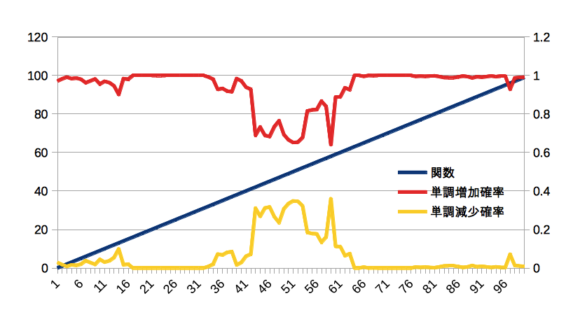
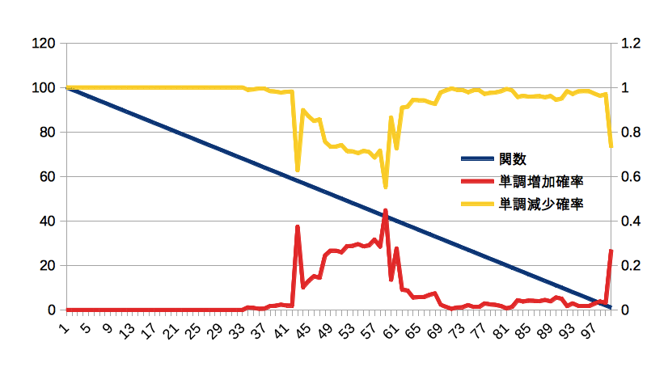

nupic_tutorials
====

## 目的
+ tutorialを通して, Nupic の使い方を把握する

## CLA White Paper
+ 多分これ読んでないと何してるかよくわからんと思う.
+ [CLA White Paper](http://numenta.org/cla-white-paper.html)

## Install
+ だいたいここの通りにやればできた.
+ [nupic](https://github.com/numenta/nupic )

## tutorials
### 一覧
+ [Using NuPIC](nupic_tutorials)
  + ipython_notebook
  + one_gym
  + one_gym_anomaly
  + sine_wave
  + spatial_pooling
  + temporal_pooling
  + audiostream

### ipython_notebook
+ notebookにまとめてくれている. 
+ しかし, これは必要なもの探すときに使った方がいい.
```
cd ipython_notebook
ipython notebook
```

### one_gym
+ どっかのジムのエネルギー消費量のデータを使って予測をしてみる.
+ [online predict framework](https://github.com/numenta/nupic/wiki/Online-Prediction-Framework)を使っている.
+ また, OPFのモデル作成には, [swarm](https://github.com/numenta/nupic/wiki/Running-Swarms)を使っている. これは, OPFと一セットと考えても良さそう.
```
cd one_gym
python swarm.py
python run.py
```

### one_gym_anomaly
+ one_gymにanomalyをつけたもの
+ 最初は誤差が大きいが, 徐々に小さくなっていく.
+ また, 見慣れないパターンが出てきたとき誤差が大きくなるが, 次第に落ち着く状態が見られる.
```
cd one_gym_anomaly
python swarm.py
python run.py
```

### sine_wave
+ 自分で作ったsin波形をOPFを使って予測する.
+ 作られたのは, one_gym/one_gym_anomalyより後っぽい.
+ データの対象が異なるだけで, やってることは, one_gym_anomalyと同じ
```
cd sine_wave
python experiment.py
```

### spatial_pooling
+ OPFを使わず, spatial_poolingを単体やってみる.
+ これは, Sparse Distributed Representations(SDR)を作るための手法
```
cd one_gym_anomaly
python hello_sp.py
```

### temporal_pooling
+ OPFを使わず, temporal_poolingを単体やってみる.
+ これは, 時系列パターンの予測をするための手法
```
cd one_gym_anomaly
python hello_tp.py
```

### audiostream
+ マイクから入力した音をTPの入力として, 予測を行うtutorial.
+ 周波数成分を入力としてる
  + 音 -> sampling値 -> 含まれる周波数 -> input
+ OPFを使わず, temporal_pooling飲み使っている.
+ マイク持ってないから, 音源ファイルを取り込む形にした.
+ pyaudioを使っているため, 以下をinstallする必要があった.
```
brew install portaudio
pip install pyaudio
```
```
cd audiostream
python audiostream.py
```

+ pyaudioの使い方いまいち分からんかったから, この辺が役に立った.
  + [波形を見る](http://aidiary.hatenablog.com/entry/20110607/1307449007)
  + [離散フーリエ変換](http://aidiary.hatenablog.com/entry/20110611/1307751369)
  + [高速フーリエ変換](http://aidiary.hatenablog.com/entry/20110514/1305377659)

### classification
+ OPFを使って, 分類をしてみる.
+ 予測するときは, カテゴリを入力せずに予測するため, 
+ モデルでは classifierOnly=Trueとして, sensorには入力しないようにする.
+ これを使うと, cla-classifierでのみ使われる.
```
cd cla_classifier
python run_class.py
```

### network_api
+ 概要
  + OPFを使わず, network apiを使ってみる.
  + [ここ](https://github.com/numenta/nupic/tree/master/examples/network)を参考にしている.
  + OPFの劣化コピーになってしまったが, 自前のネットワークを作ることは出来るようになった.
  + やってみたタスクは, 分類.

+ 実行方法
```
cd network_api
python function_prediction.py
```

+ 分類
  + 単調増加関数/単調減少関数の(x,y)を入力として, どちらの関数であるかを判別する.
  + x=0, 100 に近づくほど, 単調増加/単調減少x,yの差が大きくなるので, よく判別できる.
  + x=50付近では, 単調増加/単調減少の差が小さくなるため, 正しい予測を出す確率が下がる.
  + 特にx=50のときは, 単調増加/単調減少どちらの場合でも, networkに入力される値は(50, 50)となるが, TPに記憶されている文脈で増加か減少かを判別することが出来る.




### network_api_cc
+ nupic.coreを動かしてみる.
+ ビルドは, [ここ](https://github.com/numenta/nupic.core)の通り.

